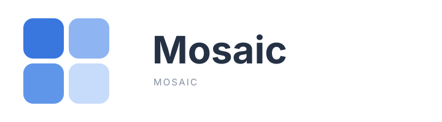

<a href="https://mosaic.app" target="_blank" rel="noopener">
  
</a>

# Mosaic

<p>
  <a href="https://mosaic.app">Mosaic Editor</a> &nbsp;|&nbsp;
  <a href="https://github.com/dramatic4678565/mosaic">Repository</a> &nbsp;|&nbsp;
  <a href="https://mosaic.app">Website</a>
</p>

A collaborative whiteboard for sketching diagrams with a hand-drawn feel.

Mosaic is built on [excalidraw/excalidraw](https://github.com/excalidraw/excalidraw) and is kept in sync with it automatically, so you get upstream fixes and features without losing your own branding.

---

## What's here

```
mosaic-app/          the deployable web app (this is what you run)
packages/mosaic/     the embeddable editor library
packages/element/    shape, arrow and binding primitives
packages/common/     shared constants, types and utilities
packages/math/       geometry helpers
packages/utils/      small utility exports
branding/            logo sources and the brand source of truth
```

## Quick start

```bash
yarn install
yarn start          # dev server on http://localhost:3000
yarn build          # production build into mosaic-app/build
```

## Embedding the editor

The library is published under the `@mosaic` scope:

```bash
npm install @mosaic/mosaic
```

```jsx
import { Mosaic, convertToMosaicElements } from "@mosaic/mosaic";
import "@mosaic/mosaic/index.css";

export default function App() {
  return (
    <Mosaic
      initialData={{
        elements: convertToMosaicElements([
          {
            type: "rectangle",
            x: 80,
            y: 60,
            width: 160,
            height: 90,
          },
        ]),
      }}
    />
  );
}
```

Served as a self-contained bundle it works too:

```html
<script src="https://esm.sh/@mosaic/mosaic@0.18.0/dist/prod/"></script>
```

There are runnable examples in [`examples/`](./examples), and the API is documented in [`dev-docs/`](./dev-docs).

### Coming from Excalidraw?

The rename is soft, not a hard break. See [BRANDING.md → Backwards compatibility](./BRANDING.md#backwards-compatibility):

- `@mosaic/mosaic/compatibility` re-exports the old `Excalidraw*` names
- `window.MOSAIC_*` globals are read with `window.EXCALIDRAW_*` as a fallback
- `.excalidraw` files, i18n keys, storage keys and CSS class names are unchanged

## Features

- Infinite canvas with hand-drawn elements
- Library of reusable shapes and styles
- Frame and element grouping
- Arrows, elbow connectors and text binding
- Mermaid and diagram import
- Live collaboration
- Export to PNG, SVG and the `.excalidraw` JSON format
- Embeddable, and themable through CSS variables
- PWA, offline capable

## Contributing

See [CONTRIBUTING.md](./CONTRIBUTING.md). The development guide lives in [`dev-docs/docs/@mosaic/mosaic/development`](./dev-docs).

This project follows the conventions in [AGENTS.md](./AGENTS.md).

## Branding

`branding/mosaic-brand.json` is the single source of truth for the name, tagline, copy, colours and asset paths. To change the identity:

```bash
node scripts/build-brand-assets.cjs    # regenerate the images
node scripts/sync-brand-into-html.cjs   # bake the meta tags in
```

Full details, including what is deliberately _not_ renamed and why, are in [BRANDING.md](./BRANDING.md).

## Keeping up with upstream

An automated workflow merges new upstream commits into this repository every six hours, opening a pull request and auto-merging when the merge is clean. When it conflicts, it stops and opens an issue for a human. See [MOSAIC-SYNC-GUIDE.md](./MOSAIC-SYNC-GUIDE.md) for the local workflow.

## License

[MIT](./LICENSE), inherited from upstream excalidraw. Copyright (c) 2020 Excalidraw.
